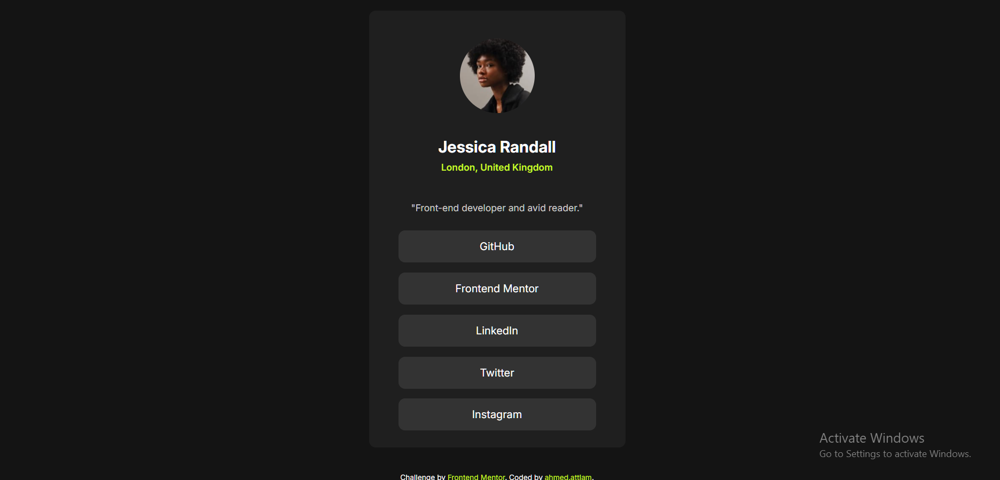

# Social Links Profile

## 📌 Overview

This is my solution for the **Social Links Profile** challenge from Frontend Mentor.  
The goal was to build a simple and responsive profile card with social links.

---

## 🛠 Built With

- HTML5
- CSS3
- Flexbox
- CSS Variables

---

## 💡 What I Learned

- How to structure a simple profile card using semantic HTML  
- Using Flexbox to center elements properly  
- Styling links as buttons  
- Handling hover and focus states  
- Using CSS variables for better organization  
- Uploading projects using Git & GitHub  

---

## 🔗 Links

- 🔗 GitHub Repository:  
https://github.com/ahmedattlam10/social-links-profile

- 🌍 Live Site:  
(هنضيفه بعد GitHub Pages)

---

## 👤 Author

- GitHub: https://github.com/ahmedattlam10